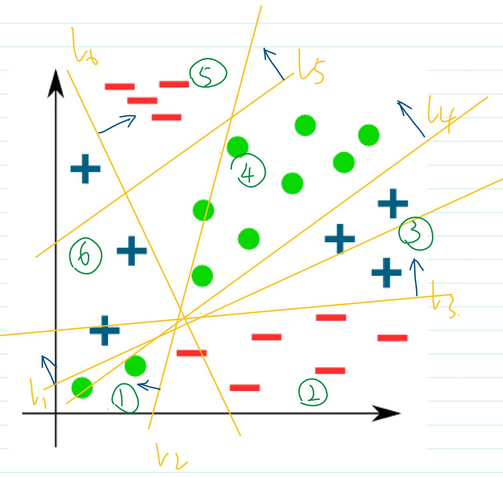

# Exercise 2

Authors:
- Tuoxing Liu
- Sima Esmaeili
- Shruti Ghargi

## Exercise 2.1

First layer's decision boundaries and normal vectors:
- The decision boundaries are drawn as yellow straight lines
- The normal vectors are drawn in blue arrows
  

### Design single neurons

Design single neurons to perform following tasks.

#### logical OR

- weights: all 1 vector
- bias: -0.5 (to deal with the problem of comparing float point numbers)
- activation function: 
$$
f: \R \rightarrow \{0,1\} \quad
f(x)= \left\{ \begin{array}{rcl}
    1 & \text{for} & x>0 \\
    0 & \text{for} & x\leq 0 \\
\end{array} \right.
$$

#### masked logical OR

- weights: the fixed binary vector $c \in \{0,1\}^{D} $ 
- bias : -0.5
- activation function:
$$
f: \R \rightarrow \{0,1\} \quad
f(x)= \left\{ \begin{array}{rcl}
    1 & \text{for} & x>0 \\
    0 & \text{for} & x\leq 0 \\
\end{array} \right.
$$

#### perfect match

for the fixed binary vector c

- weights: $v_{pow}:=[1,2,4,...,2^{D}]^{T}$ 
- bias : 0
- activation function:
$$
f: \R \rightarrow \{0,1\} \quad
f(x)= \left\{ \begin{array}{rcl}
    1 & \text{for} & x = c \cdot v_{pow} \\
    0 & \text{for} & \text{otherwise} \\
\end{array} \right.
$$

Note the output of first layer as $v_{i}$ in the following way:

$$
\begin{align*}
&(1) v_{1}:=[0,1,0,1,0,0] \\
&(2) v_{2,3}:=[0,0,0,0,0,0/1] \\
&(3) v_{4,5}:=[0/1,0,1,0,0,1] \\
&(4) v_{6,7}:=[1,0/1,1,1,0,1] \\
&(5) v_{8}:=[1,1,1,1,1,1] \\
&(6) v_{9-12}:=[1,1,0/1,1,0/1,0] \\
\end{align*}
$$

### For the second layer:
- Contain 12 neurons $N_{2,i}, i=1,...,12$
- The weight of neurons is $v_{pow}:=[1,2,4,...,2^{D}]^{T}$ 
- The bias of all neurons is 0
- The activation functions are:
$$
\sigma_{2,i}: \R \rightarrow \{0,1\} \quad
\sigma_{2,i}(x)= \left\{ \begin{array}{rcl}
    1 & \text{for} & x = v_{i} \cdot v_{pow} \\
    0 & \text{for} & \text{otherwise} \\
\end{array} \right.
$$

Then neurons in second layer $N_{2,i}, i=1,...,12$ are equivalent to $h(z;v_{i}), i=1,...,12$, $h$ is perfect match function.

Define $\delta_{S}(x), \quad S \subseteq 2^{\Z}$ is a set contains the indexes of $v_{i}$ .
$$
\delta_{S}: \R \rightarrow \{0,1\} \quad
\delta_{S}(x)= \left\{ \begin{array}{rcl}
    1 & \text{for} & x \in S \\
    0 & \text{for} & x \notin S \\
\end{array} \right.
$$

### For the third layer:
- Contain 3 neurons $N_{3,1},N_{3,2},N_{3,3}$
- Weights:
    - $ w_{1}:=(\delta_{\{1,6,7\}}(a_{i}))_{i=1,...,12}^{T}$, i.e. $[1,0,0,0,0,1,1,0,0,0,0,0]^{T}$
    - $ w_{2}:=(\delta_{\{2,3,8\}}(a_{i}))_{i=1,...,12}^{T}$
    - $ w_{3}:=(\delta_{\{4,5,9,10,11,12\}}(a_{i}))_{i=1,...,12}^{T}$
- The bias of all neurons is -0.5 (to deal with the problem of comparing float point numbers)
- The activation function of all neurons is 
$$
\sigma_{3}: \R \rightarrow \{0,1\} \quad
\sigma_{3}(x)= \left\{ \begin{array}{rcl}
    1 & \text{for} & x>0 \\
    0 & \text{for} & x\leq 0 \\
\end{array} \right.
$$

### The equations for the network's second and third layer:
- second layer: $Z_{2} = (h(Z_{1};v_{i}))_{i=1,...,12}$ or $Z_{2} = (\sigma_{2,i}(Z_{1} \cdot v_{pow}))_{i=1,...,12}$, $h$ is the perfect match function, $v_{i}$ are the results of first layer, each $v_{i}$ represents a cluster or one corner of the hypercube
- third layer: $Z_{3} = (g(Z_{2};w_{i}))_{i=1,2,3}$ or $Z_{3} = \sigma_{3}(Z_{2} \cdot [w_{1},w_{2},w_{3}])$, $g$ is the masked logical OR function, $w_{i}$ are the masks for different clusters with same data label.

### How could it be generalized to arbitrary many input dimensions and arbitrary (non degenerate) label distributions?

The input dimension mainly changes the first layer of the network. The higher the input dimension, the higher the dimension of hyperplanes is needed to use to separate the data. The length of weights in the first layer can be very large if the input dimension is very large. However, this classifier still works.

The label distribution only changes the number of hyperplanes. The more dispersed the data label is, the more hyperplanes are needed to separate the data. As long as the data can still be separated by hyperplanes, it doesn't change the conclusion.

### The potential problems with this classifier are:
- Some data can NOT be classified: e.g. $v=[0,0,0,0,1,0]^{T}$
- The parameters of classifier can be very large, since it needs to store all unique results from the first layer.
- The number of neurons in the second layer can be very large, since every unique vector from the first layer needs an exclusive neuron.

## Exercise 2.2

$$
\begin{array}{lcl}
\text{For L = 1 :} \\
Z_{0} = X \\
\tilde{Z}_{1} = Z_{0}B_{0} + b_{0} \\
Z_{1}=\tilde{Z}_{1}=XB_{0} + b_{0}
\end{array} \\
$$

$$
\begin{array}{lcl}
\text{For L = 2 :} \\
\tilde{Z}_{2} = Z_{1}B_{1} + b_{1} \\

\begin{align*}
Z_{2}&=\tilde{Z}_{2}\\
&=(Z_{0}B_{0} + b_{0})B_{1} + b_{1}\\
&=XB_{0}B_{1} + b_{0}B_{1} + b_{1}\\
\end{align*}

\text{Let} \tilde{B}_{1} = B_{0}B_{1}, \tilde{b}_{1} = b_{0}B_{1}+ b_{1}, \\
\Rightarrow Z_{2} = X\tilde{B}_{1} + \tilde{b}_{1} \\
\therefore \text{network with depth L = 2 is equivalent to 1-layer network (a)} 
\end{array}
$$

$$
\begin{array}{lcl}
\text{For L = n and L = n+1 :} 

Z_{n}=Z_{n-1}B_{n}+b_{n}\\

\begin{align*}
Z_{n+1}&=Z_{n}B_{n+1}+b_{n+1} \\
&=(Z_{n-1}B_{n}+b_{n})B_{n+1}+b_{n+1} \\
&=Z_{n-1}B_{n}B_{n+1} + b_{n}B_{n+1}+b_{n+1} \\
\end{align*}

\text{Let} \tilde{B}_{n+1} = B_{n}B_{n+1}, \tilde{b}_{n+1} = b_{n}B_{n+1}+ b_{n+1}, \\

\Rightarrow Z_{n+1} = Z_{n-1}\tilde{B}_{n+1}+\tilde{b}_{n+1}\\
\therefore \text{network with depth L = n is equivalant to network with depth L = n + 1 (b)}  \\

\because \text{(a) and (b)} \\
\therefore \text{Any network with depth L larger than 1 is equivalent to a 1-layer network}
\end{array}
$$

